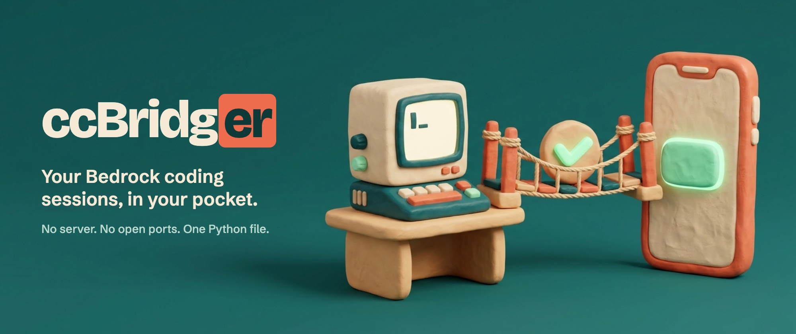
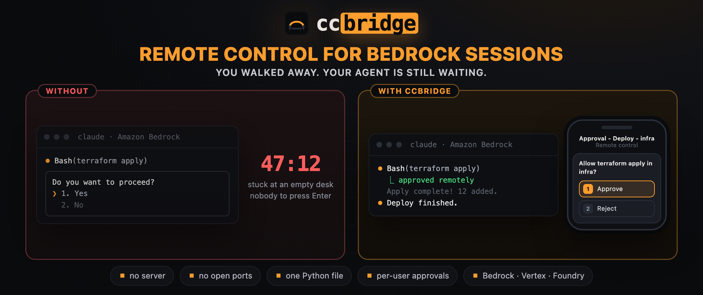

# You Walked Away From Your Desk. Your Coding Agent Is Still Waiting for a "Yes".

### Why Claude Code sessions on Bedrock, Vertex and Foundry are stuck in the terminal — and how I gave them a remote control with hooks, a file queue and one Python file



> **TL;DR** — Claude Code's Remote Control needs a Claude subscription login. Sessions that run through an API provider — AWS Bedrock, Google Vertex AI, Microsoft Foundry — don't get it, so a single permission prompt can stall an hour of work while you are in a meeting. ccBridger is a small open-source bridge: hooks record what the session needs, a tiny helper session shows it in the Claude mobile app as a native prompt, and your tap goes back to the terminal. No server, no open ports, standard library only.
>
> 🔗 **[github.com/fxerkan/ccbridger](https://github.com/fxerkan/ccbridger)**

---

## The problem

A lot of companies run Claude Code through their cloud provider instead of a Claude subscription: AWS Bedrock, Google Vertex AI or Microsoft Foundry. The reasons are sensible: billing lands on the cloud invoice, data stays inside the account, access goes through the provider's own identity system. I work that way on two client projects, both on Bedrock.

What you give up is Remote Control. With a subscription login you can open the Claude app on your phone, see the session that is running on your laptop, answer its questions and keep it moving. With an API provider that door is closed. The session lives in the terminal tab where you started it, and nowhere else.

That sounds like a small inconvenience until you look at how agent work actually goes:

- You start a long task — a migration, a refactor, an infrastructure change — and go to a meeting.
- Eight minutes in, the agent wants to run a command it isn't allowed to run on its own. It asks. Nobody answers.
- You come back fifty minutes later to a prompt that says *Do you want to proceed?* and an agent that has done nothing since.

The other failure mode is worse. To avoid the stall, people start sessions with `--dangerously-skip-permissions`. Now nothing waits for you — including the things that should.

And it isn't only permissions. Agents ask real questions too: *"The upgrade can't be rolled back. Test workspace first, or straight to prod?"* That is exactly the decision you want to make yourself, and exactly the one that sits unanswered while you are away.



## An analogy before the tech

Picture a contractor renovating your kitchen while you are at work. They are good and fast, but they have one rule: before knocking down a wall, they ask. If they can only ask by knocking on your study door, the work stops the moment you leave the house. Give them your phone number and the same rule costs you ten seconds instead of an afternoon.

ccBridger is the phone number. The rule — ask before doing something that matters — stays exactly as it was.

## Why the obvious answers don't fit

- **"Just SSH in and attach to tmux."** Works, on a laptop keyboard. On a phone, typing into a terminal UI to press `1` is miserable, and you only find out there is something to answer if you go and look.
- **"Build a web dashboard."** Now there is a server to run, a port to expose, authentication to get right, and a new place where your prompts and commands live.
- **"Wrap the CLI."** A wrapper has to sit between you and the terminal all the time, and it changes how you start every session.
- **"Skip permissions."** See above.

What I wanted was narrower:

> Keep working exactly as before. If I'm at the keyboard, nothing changes. If I'm not, the question finds me — in an app I already have, on an account I already own — and my answer goes back. Nothing to host.

## The idea: borrow the Remote Control you already have

Remote Control doesn't work for the API-based session. But it works fine for a *different* session on the same machine that runs on my own Claude login. So the bridge doesn't try to remote-control that session at all. It starts a tiny second session whose only job is to ask me a question, and lets Remote Control carry that question to my phone.

Three pieces make that work.

### 1. Hooks on the API-based session

Claude Code runs hooks — shell commands — at defined points. `ccb install` adds five of them:

| Hook | What ccBridger does with it |
|---|---|
| `PermissionRequest` | Writes the request (tool, input) to a file, then waits for a decision file. The terminal prompt stays live the whole time. |
| `Stop`, `SessionStart`, `UserPromptSubmit`, `Notification` | Keep one background *waiter* per session alive. |

The decision goes back as the hook's JSON output:

```json
{"hookSpecificOutput": {"hookEventName": "PermissionRequest",
                        "decision": {"behavior": "allow"}}}
```

The waiter is how a message reaches an idle session. Those four hooks are registered with `asyncRewake`: they run in the background, and when one exits with code 2, Claude Code wakes the session and hands it the hook's stderr. So the waiter polls an inbox file; when a message lands, it prints the message and exits 2. The idle session wakes up and treats it as something the user said.

Four hooks for one waiter looks redundant. It isn't: a turn interrupted with Esc never fires `Stop`, so without the others the waiter would be gone until the next full turn.

### 2. A file queue

All state is plain files under `~/.claude/ccbridger/`, one directory per session: `pending.json`, `decision.json`, `inbox`, `waiter.pid`. Writes are atomic renames; the inbox is taken with a rename so exactly one waiter gets each message. Polling is once a second. There is no daemon and nothing listens on the network.

Which sessions exist, and whether each is idle, busy or waiting, comes from Claude Code's own registry in `~/.claude/sessions/`. What a session is doing comes from its transcript file. `ccb ls` and `ccb show` are just readers for those two things.

### 3. The relay session

When a request has waited 15 seconds without a local answer, the hook starts the relay in `tmux` (simplified):

```bash
claude --model haiku --tools AskUserQuestion --remote-control "Approval - Prod deploy - infra" \
       --append-system-prompt "<relay instructions>" --settings '<two hooks>' "<the request>"
```

A few things about that line matter:

- **It runs on my Claude login**, with the provider variables (`CLAUDE_CODE_USE_BEDROCK`, `…_VERTEX`, `…_FOUNDRY`) stripped, so Remote Control is available.
- **It has exactly one tool**, `AskUserQuestion`. It cannot read files or run commands. Its whole job is to turn the request into a native question in the Claude app.
- **The model never decides anything.** A `PostToolUse` hook on the relay reads the answer I tapped and writes the decision file itself. Only the exact *Approve* label counts as approval; anything else — *Reject*, free text, a typo — is a rejection.

There is one relay per bridged session and it stays open, so the conversation on the phone becomes a readable history: what was asked, what I answered, in order. Its title follows the topic of the latest request.

## Questions, and why answers are mapped by position

When the bridged session calls `AskUserQuestion`, the relay asks the same question with the same options. Early on I noticed the small relay model sometimes shortened the option text. For a question like "upgrade prod now?" that is not a detail I wanted to leave to chance.

So the relay hook doesn't forward the label I tapped. It finds the *position* of my choice among the options the relay showed and maps it onto the option at the same position in the original question. The wording on the phone can drift; the answer cannot. The original text is always in the message right above the prompt.

## A two-way conversation

Approvals were the starting point, but once the relay existed the next step was obvious. The relay has a `UserPromptSubmit` hook: anything I type into that conversation that isn't one of ccBridger's own messages is put into the session's inbox instead of being answered by the relay model. The waiter delivers it. When the session finishes its turn, its `Stop` hook pastes the final message back into the relay.

So from the phone I can write *"Is the upgrade done? Are all the filters working?"* and get the real session's answer in the same thread. If the session is busy, I'm told so, along with what it is doing right now and that my message is queued.

## Teams: one cloud account, many people

API access is often shared across a team — one AWS account, one GCP project, one Azure resource. The bridge is not shared, and that falls out of the design rather than being added to it:

- Every developer installs ccBridger on their own machine. State lives under their own `~/.claude`.
- The relay runs on that person's own Claude login, so prompts land only in their Claude app. Nobody can see or answer anyone else's.
- There is nothing central to run, patch or secure.

For anything beyond the app, each person can set a `notify_cmd` in their config — a shell command that runs once per request with the title and body in its environment. That covers Slack, ntfy, Gotify or a pager, per user. People without a Claude subscription can turn the relay off and answer with `ccb ok` over SSH.

## Getting started

```bash
git clone https://github.com/fxerkan/ccbridger.git && cd ccbridger
ln -s "$PWD/ccbridger" ~/.local/bin/ccbridger
ln -s "$PWD/ccbridger" ~/.local/bin/ccb     # short alias
ccb selftest

ccb install --global          # every Bedrock / Vertex / Foundry session
# or: ccb install ~/code/project-a ~/code/project-b
```

`--global` stays out of the way of sessions that already run on a Claude login. Restart the sessions you want bridged, and that's it. From any terminal:

```bash
ccb ls                        # sessions, status, what is pending
ccb show infra                # what that session has been doing
ccb ok infra                  # approve      ·  ccb no infra "not on prod"
ccb answer infra 1            # answer a question by option number
ccb send infra "run the tests again and summarise the failures"
ccb open infra                # open the phone conversation without waiting for a request
```

## What I learned building it

A few things only showed up once it met real sessions:

- **A hook is not killed when you answer locally.** The `PermissionRequest` hook kept waiting after I pressed Enter in the terminal, so requests looked pending forever. It now watches the session's status and leaves when the session stops waiting.
- **Pressing Enter in the wrong place approves things.** The relay is driven through `tmux`. Sending Enter while a question is on screen selects the first option — *Approve*. The code checks what is on screen before it sends a key, and a second hook process for the same request is not allowed to ask twice.
- **Text pasted too early disappears.** A follow-up request pasted into the relay while it was still finishing the previous one was silently lost. It now waits until the relay is idle.
- **My own test sessions reached my phone.** They ran on my login, so their prompts showed up in my app and I answered one without knowing what it was. For a while I blamed Claude Code for "ignoring" an answer that I had, in fact, overridden myself.

## Honest limits

- A session started with `--dangerously-skip-permissions` never asks, so there is nothing to approve. Watching and messaging still work.
- Only the last message of a turn comes back to the phone, not every step.
- Answers to questions reach the session as text; in the terminal that shows up as a denied tool call followed by the session carrying on with your answer.
- It depends on things Claude Code doesn't promise to keep stable: the session registry, the hook behaviour, a few strings on the terminal screen. A future release can break it. The built-in self-test covers the queue logic, not the live integration.
- Developed and tested on macOS, with live sessions on AWS Bedrock. Vertex AI and Foundry go through the same hooks and are detected the same way, but I haven't run live sessions on them yet. Linux should work; I haven't tried it either.

## Why this matters

Permission prompts are the part of agent tooling that keeps a human in the loop. The moment they become an obstacle, people remove them. I would rather make saying yes or no cost ten seconds from wherever I am than choose between an agent that waits all afternoon and one that never asks.

The whole thing is one Python file, MIT-licensed, with no dependencies. Read it, run the self-test, and watch the network: there is nothing to see there.

---

**Links**
- ⭐ GitHub: [github.com/fxerkan/ccbridger](https://github.com/fxerkan/ccbridger)
- 📦 Install: `git clone` · `ln -s` · `ccb install --global`

*If this was useful, a ⭐ on GitHub helps other people who are stuck at the same prompt find it.*
